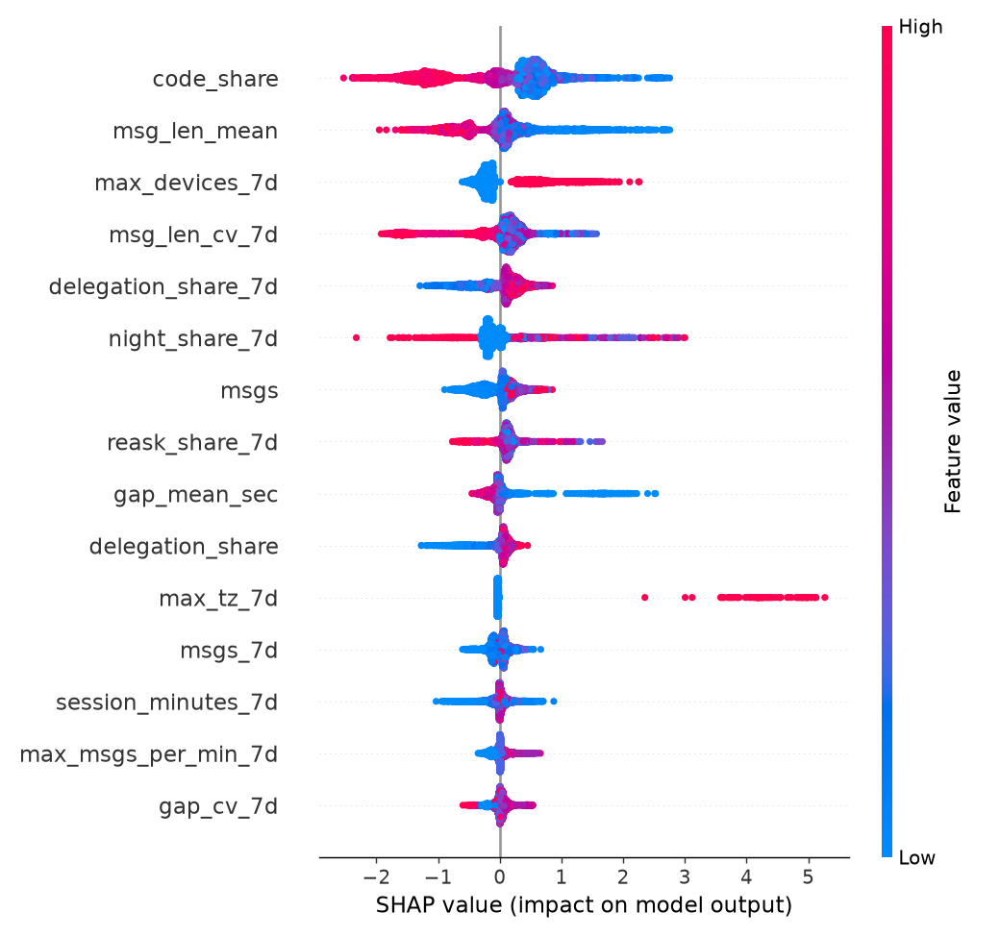
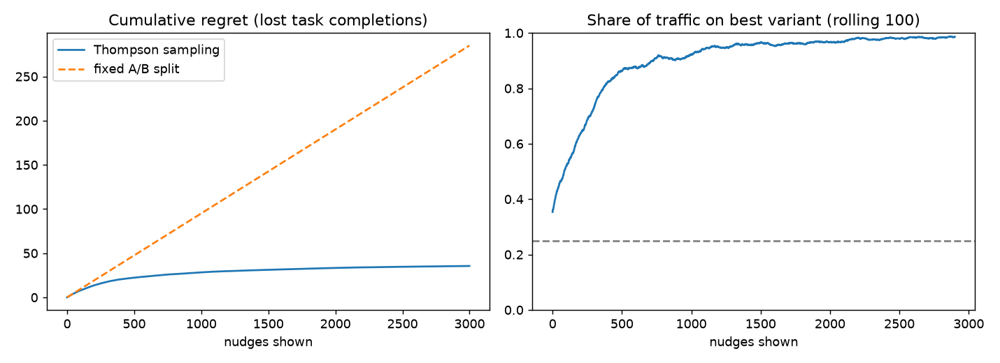

# Cognitive: risk control for your own attention

A personal AI "second brain" that treats **AI over-reliance as a risk-control problem**. A browser
extension logs how you use ChatGPT, Claude, Gemini, DeepSeek and Perplexity. It extracts prompt
features **on-device**, so prompt text never leaves the browser. The events flow into a layered
**Spark warehouse** (ODS → DWD → DWS → ADS) with **data-quality monitoring**. A **risk model**
(rules vs IsolationForest vs LightGBM, evaluated out-of-time with AUC/KS) and a **real-time decision
engine** use the resulting features. The engine picks nudges through a **Thompson-sampling
experiment**. An **LLM agent** answers questions over the warehouse with guarded text-to-SQL and
writes analyst case notes and weekly reviews.

The original app is still here: FastAPI + SQLite task manager, FAISS memory, Ollama chat agent with
an intent classifier, task-duration predictor, and Streamlit UI.

> Population-level data (2,000 users × 60 days, 2.7 M events) is **synthetic**, produced by
> `pipeline/simulator` with labelled risky personas and injected data defects, so that models and DQ
> checks have ground truth. The personal "Me" views use real extension data.

```
 Chrome extension ──(features only)──►  FastAPI  ──►  /decision  (rules → action + reason codes → bandit picks nudge)
   prompt_features.js                     │                │
                                          ▼                ▼ outcome: task done within 2h?
                                   ai_usage_events     decision_logs ───► Thompson sampling posterior
                                          │
 simulator (2k users) ──► raw JSONL (dt=YYYY-MM-DD)
                                          │
                     ┌────────── PySpark / Spark SQL ──────────┐
                     │ ODS  typed, schema-contracted            │
                     │ DWD  dedup · quarantine · sessionize     │──► DQ checks (schema, volume, dup, null,
                     │ DWS  user×day aggregates                 │     clock skew, PSI) → alerts per dt
                     │ ADS  rolling-7d features · CDI           │
                     └──────────────────────────────────────────┘
                                          │
                     rules · IsolationForest · LightGBM (out-of-time) → AUC/KS, SHAP reasons
                                          │
                     ads_user_risk_score_1d ──► DuckDB (read-only) ──► API · LLM analyst · Streamlit
```

## Results

Pipeline run: 2,000 users × 60 days, **2.69 M events**. On local-mode Spark in WSL it takes
~13 minutes end to end.

| layer | rows | |
|---|---:|---|
| ODS `ods_ai_events` | 2,688,309 | typed raw events |
| DWD `dwd_ai_events_di` | 2,683,185 | after dedup (−3.1 k retries) and quarantine (−2.0 k NULL users) |
| DWS `dws_user_ai_1d` | 74,407 | user × day |
| ADS `ads_user_features_1d` | 74,407 | 39 features |

**Risk model, out-of-time test** (train 06-07..07-06, early-stop on 07-07..07-14, test on
**07-15..07-30**, positive rate 3.7%):

| model | AUC | KS | PR-AUC | precision@1% | precision@5% | recall@5% |
|---|---:|---:|---:|---:|---:|---:|
| rules (6 expert rules, no labels) | 0.762 | 0.517 | 0.283 | 0.673 | 0.379 | 0.509 |
| IsolationForest (no labels) | 0.869 | 0.578 | 0.382 | 0.759 | 0.320 | 0.430 |
| **LightGBM** | **0.981** | **0.882** | **0.847** | **0.930** | **0.654** | **0.878** |

Recall in the top 5%, by risk type:

| | bot | scraper | shared account |
|---|---:|---:|---:|
| rules | 0.27 | 0.45 | 0.70 |
| IsolationForest | 0.66 | 0.54 | 0.21 |
| LightGBM | 0.95 | 0.93 | 0.80 |

What these numbers say:
- **Different methods catch different risks.** Rules catch account sharing (hard time-zone and
  device signals) but miss camouflaged bots. IsolationForest catches bots and scrapers, which are
  statistically weird, but not shared accounts, which look like two normal people.
- **The model finds bad users the labels missed.** 15% of risky users were deliberately left
  unlabelled, like fraud nobody has reported yet. All **14 of the 14** "false positives" in
  LightGBM's top 1% are in fact those hidden risky users. **85%** of the hidden risky user-days
  rank in the top 5%.
- **Honest caveat.** The top SHAP feature, `code_share` (low code → risky), is partly a
  *simulator artifact*: the risky personas rarely paste code. The behavioural features are the
  ones expected to transfer to real data: `max_devices_7d`, `max_tz_7d`, `night_share_7d`,
  `msg_len_cv_7d` and `gap_mean_sec`. A production version would test robustness by dropping
  persona-specific features. 

**Nudge experiment (offline simulation, 20 seeds × 3,000 nudges).** Thompson sampling loses
**87.5% fewer** task completions than a fixed 25/25/25/25 A/B split. In the last 500 rounds it
routes 98% of traffic to the best variant. 

## Data-quality incidents the pipeline caught

The simulator injects five realistic defects. The DQ layer raised **exactly 5 alerts on 60 days:
all 5 defects, zero false alarms**, and each alert names where the problem is:

| dt | check | where | signal | root cause → fix |
|---|---|---|---|---|
| 06-20 | duplicate_rate | `event_id` | 7.4% repeated ids (3.1 k) vs < 0.01% baseline | extension retries after a lost 5xx response → DWD dedups on `event_id`; the ingest API is idempotent |
| 07-04 | null_rate | `user_id` | 5.0% NULL | events sent while logged out → rows go to `dwd_ai_events_quarantine` for backfill |
| 07-11 | clock_skew | platform = `gemini` | median server−client lag **−3600 s** | client timezone bug on one platform → features use server `event_ts`, never `client_ts` |
| 07-20 | schema_contract | `msg_len` → `message_length` | contract field missing, unknown field present | extension v1.1 renamed a field → ODS `COALESCE(msg_len, message_length)`; without it, one day of `msg_len` would silently be NULL |
| 07-26 | volume | platform = `deepseek` | 13% of trailing-7-day median | site DOM change broke the content-script selector → fix the selector, mark the day incomplete |

Feature drift is monitored with PSI against the first 14 days (warn 0.1, alert 0.25). No feature
drifted, which is correct for a simulator with a stationary population.

## What each part shows

| Skill | Where |
|---|---|
| **Spark / Hive-style warehouse** | `pipeline/spark/jobs.py`, 4 layers, Parquet partitioned by `dt`, dynamic partition overwrite (idempotent re-runs) |
| **SQL** (window functions, self-joins, percentiles, entropy) | `pipeline/spark/sql/*.sql`: `LAG` sessionization, `RANGE` rolling windows, interval-overlap self-join for concurrent devices |
| **Feature engineering** | ~40 features, documented with rationale and a leakage checklist in [`docs/features.md`](docs/features.md) |
| **Data mining / modelling** | `pipeline/model/train.py`: time-based split, rules vs IsolationForest vs LightGBM, KS / precision@k, SHAP |
| **Finding and locating data problems** | `pipeline/quality/checks.py`: every alert names *where* (platform, column, feature) |
| **Risk control (风控)** | rule engine with reason codes (`rules.yaml`), decision engine (`app/decision/engine.py`), per-type recall |
| **LLM application / Agent** | `app/analyst/sql_agent.py`: text-to-SQL with self-correction loop; case notes; weekly cognitive audit in `app/llm/agent.py` |
| **LLM safety** | `app/analyst/sql_guard.py` (AST allowlist, SELECT-only, no file functions, LIMIT) + DuckDB with external access disabled |
| **Experimentation** | `app/decision/bandit.py` + `pipeline/experiments/bandit_sim.py` |
| **Privacy by design** | `cognitive-extension/content/prompt_features.js`: text → features in the page; server dedups on `event_id` |

## Quickstart

**Pipeline** (Linux/macOS/WSL, Python 3.12, Java 17+):

```bash
pip install -r requirements-data.txt
make all            # simulate → Spark warehouse + DQ → train → bandit sim   (USERS=2000 DAYS=60)
make test
```

On Windows, Spark needs Hadoop native binaries, so run the pipeline through WSL. `scripts/wsl_run.sh`
uses a user-level venv plus the `jdk4py` bundled JRE, so it needs no sudo:

```bash
wsl -d Ubuntu-24.04 -- bash scripts/wsl_run.sh make all
```

Or use Docker: `make docker-all`.

**App:**

```bash
pip install -r requirements.txt
uvicorn app.main:app --reload --port 8000
cd frontend && streamlit run app.py        # → "Risk Dashboard" page
```

Load `cognitive-extension/` as an unpacked extension in Chrome for the real-time part.

### Key endpoints

| | |
|---|---|
| `POST /ai-usage/events` | batch ingest of prompt features (idempotent on `event_id`) |
| `POST /decision` | session tick → `allow / soft_nudge / hard_nudge / cool_down` + reason codes + nudge variant |
| `GET /decision/experiment` | bandit posterior per nudge variant, P(best) |
| `GET /cdi/me` | your Cognitive Dependency Index and its components |
| `GET /risk/users`, `/risk/users/{id}/explain` | top risk scores; LLM case note with SHAP evidence vs population median |
| `GET /quality/alerts`, `GET /risk/model` | DQ alerts; model card |
| `POST /analyst/ask` | natural-language question → guarded SQL → answer |

In chat: `/data which platform has the most night-time prompts this week?` or `weekly audit`.

## Design notes

- **Why out-of-time evaluation?** Risk labels mature over time, and behaviour drifts. A random split
  would leak future behaviour of the same users into training and inflate AUC.
- **Why server-side sessionization?** Client session ids and clock times are untrusted (see the
  clock-skew incident). DWD re-derives sessions from the server `event_ts`.
- **Why quarantine instead of drop?** Rows with NULL `user_id` go to `dwd_ai_events_quarantine`, so the
  DQ layer can size the problem and a backfill is possible after a fix.
- **Why rules *and* a model?** Rules are day-1 coverage, explainable and label-free. The model
  catches the camouflaged cases the rules miss. The decision engine stays rule-based, because
  interventions must be auditable, and reason codes are logged with every decision.
- **Why a bandit instead of A/B?** With one user and few nudges a day, fixed splits waste most
  impressions on bad variants.
# cognitiveapp

